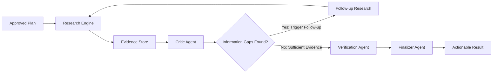

# AutoWork — Autonomous Goal-to-Action Agent
### *Give it a goal. Approve once. Let it work.*

---

## 📌 Project Overview & Metadata

- **Project Title**: AutoWork — Autonomous Goal-to-Action Agent
- **One-Line Elevator Pitch**: An autonomous AI agent that transforms high-level goals into approved workflows, executes them asynchronously in the background on Google Cloud, critiques its own findings, refines research, and produces verified, actionable deliverables.
- **Target Hackathon Track**: **Taskmaster** (Autonomous Goal Execution & Multi-Step Workflows)
- **Repository URL**: `https://github.com/Shubham-Code-Bases/AutoWork-Autonomous-Goal-to-Action-Agent`
- **Primary AI Backbone**: Google Gemini (`gemini-3.5-flash`) via Google Agent Development Kit (ADK 2.0)
- **Cloud Infrastructure**: Google Cloud Run, Google Cloud Pub/Sub, Google Cloud Firestore, Google Cloud Build

---

## 💡 Inspiration: Moving Beyond the "Chatbot Trap"

Most modern AI assistants operate in a synchronous prompt-and-answer loop:
```text
User asks  →  AI responds  →  User asks again  →  AI responds
```
For any ambitious objective (e.g. *"Evaluate the optimal AI coding agents for our engineering team"* or *"Analyze semiconductor supply chain opportunities in South Asia"*), the human is forced into constant micro-orchestration:
- Manually breaking the problem into sub-questions.
- Sitting in front of a blocking browser window waiting for multi-step reasoning.
- Catching missing details and prompt-engineering follow-ups.
- Fact-checking and verifying citations manually.

**AutoWork eliminates this orchestration tax.** We designed AutoWork around a fundamental philosophy:
> **The human defines the outcome and approves the roadmap once; AutoWork executes independently in the background, audits its own research, fixes its own information gaps, and delivers an executive-ready outcome.**

---

## 🚀 What AutoWork Does

1. **Goal → Structured DAG Plan (Phase 1)**: Accepts open-ended, high-level ambitions and uses Google ADK 2.0 with Gemini to synthesize a Directed Acyclic Graph (DAG) of typed, prioritized milestones with strict dependency ordering.
2. **One-Time Human Approval Gate (Phase 2)**: Generates an executive review dossier. The user approves, rejects, or modifies the plan. Consequential external actions are safely gated.
3. **Cloud-Native Asynchronous Execution (Phase 4)**: Upon approval, the API registers the authorization ticket, dispatches a message to Google Cloud Pub/Sub, and immediately returns with `status: "queued"`. **The user is free to close the tab or leave.**
4. **Serverless Background Worker with Atomic Leases (Phase 4)**: A Google Cloud Run Worker receives the Pub/Sub push event and claims an atomic check-and-set lease in Cloud Firestore to guarantee **idempotency** (no job is ever executed twice).
5. **Search → Critique → Refine → Verify Loop (Phase 3)**:
   - **Research Engine**: Gathers grounded evidence while preventing duplicate queries.
   - **Critic Agent**: Audits findings against constraints, detects missing metrics, and dynamically generates follow-up queries.
   - **Refinement Loop**: Recursively fills gaps up to budget limits.
   - **Verification Agent**: Verifies factual grounding and calculates an authentic confidence score (e.g. 92%).
   - **Finalizer Agent**: Synthesizes a structured, actionable deliverable with executive summaries, trade-offs, next steps, and traceable citations.
6. **Persistent State & Real-Time Dashboard (Phases 2 & 5)**: All plan versions, execution logs, and final deliverables are persisted in Firestore, allowing users to return anytime to monitor live progress.

---

## 🏗️ How We Built It (Architecture & Stack)

```mermaid
flowchart TD
    subgraph UserInterface["1. User Interface"]
        U["User"]
        UI["AutoWork Web Dashboard"]
    end

    subgraph APILayer["2. Cloud Run API Service (autowork-api)"]
        GA["Goal Analyzer (LlmAgent)"]
        PG["Plan Generator (LlmAgent)"]
        APPR["Approval & Gatekeeper"]
    end

    subgraph QueueLayer["3. Asynchronous Job Queue"]
        PS["Google Cloud Pub/Sub (Topic: autowork-executions)"]
        SUB["Push Subscription (autowork-worker-subscription)"]
    end

    subgraph StateLayer["4. Persistent State Store"]
        FS[("Google Cloud Firestore (Collections: plans, executions)")]
    end

    subgraph WorkerLayer["5. Cloud Run Worker Service (autowork-worker)"]
        LEASE["Idempotent Atomic Lease Claim"]
        RT["AutoWork Phase 3 ADK Runtime"]
        RE["Research Engine & Grounded Citations"]
        CR["Critic Agent & Refinement Loop"]
        VA["Verification Agent"]
        FA["Finalizer Agent"]
    end

    subgraph CognitiveBackbone["6. Google AI Backbone"]
        GEM["Gemini (gemini-3.5-flash / Vertex AI)"]
    end

    U -->|Submit Goal & Approve Plan| UI
    UI -->|REST API| APILayer
    APILayer -->|1. Create Plan & Authorize| FS
    APILayer -->|2. Publish execution_id (Non-blocking)| PS
    APILayer -->|3. Return immediately (QUEUED)| UI

    PS -->|Push Message| SUB
    SUB -->|Invoke Worker Endpoint| LEASE
    LEASE -->|Claim Lock (QUEUED → RUNNING)| FS
    LEASE -->|Execute Plan| RT

    RT --> RE & CR & VA & FA
    RT <--> GEM
    RT -->|Stream Logs & Checkpoints| FS
    FA -->|Persist Actionable Result| FS

    UI -.->|Poll Live Progress & Results| FS
```

### The Autonomous Refinement Engine (Search → Critique → Refine → Verify)



### Technology Stack
- **AI Models**: Google Gemini (`gemini-3.5-flash`) via Google Cloud Vertex AI / Gemini API
- **Agent Framework**: Google Agent Development Kit (ADK 2.0) — `LlmAgent`, `SequentialAgent` pipelines
- **Compute & Serverless**: Google Cloud Run (Decoupled API and Worker containers)
- **Messaging**: Google Cloud Pub/Sub (Asynchronous push subscription)
- **Database & Persistence**: Google Cloud Firestore (Native NoSQL Mode)
- **CI/CD & Containers**: Google Cloud Build, Docker, Artifact Registry
- **Backend & Validation**: Python 3.12, FastAPI, Pydantic v2, Uvicorn
- **Testing & Quality**: Pytest (55 automated tests, 100% pass rate), Ruff
- **Development Accelerator**: Antigravity IDE

---

## 🛡️ Safety, Human Control & Consequential Action Gating

1. **Explicit Human Gate**: Plans are never executed upon creation; execution strictly requires an immutable `ExecutionAuthorization` ticket granted by a human.
2. **Application-Level Enforcement**: Authorization checks are strictly enforced in Python application logic, not delegated to model assumptions.
3. **External Mutation Isolation**: Dangerous actions (`EXTERNAL_ACTION`, `DESTRUCTIVE`) are categorized by safety vocabulary and isolated as recommendations rather than blind automated triggers.
4. **Bounded Autonomous Budgets**: Strict limits on research iterations (max 3), total search calls (max 15), and query timeouts protect against runaway loops and unnecessary cost.

---

## 🏆 Hackathon Judging Criteria Alignment

| Judging Dimension | Weight | How AutoWork Excels |
| :--- | :---: | :--- |
| **Innovation & Operational Utility** | **40%** | Solves the AI orchestration bottleneck by shifting from prompt-by-prompt babysitting to goal-oriented background completion with self-critique and refinement. |
| **Architectural Discipline & Tech Stack** | **30%** | Authentic multi-service cloud architecture: decoupled Cloud Run containers, non-blocking Pub/Sub queuing, Firestore atomic lease claiming, and Google ADK 2.0 pipelines. |
| **Demo & Production Readiness** | **30%** | Fully tested with 55 unit/integration tests passing (100%), reproducible Docker/Cloud Build setups, clean UI with live Firestore stream, and traceable citations. |

---

## 📈 What We Learned & Key Takeaways

1. **Multi-Agent Specialization beats Monolithic Prompts**: Splitting research, critique, verification, and finalization into discrete specialist agents dramatically improved hallucination prevention and evidence grounding.
2. **True Asynchrony requires Decoupled Ingestion and Execution**: Decoupling the user-facing API from long-running agent execution via Pub/Sub and Cloud Run eliminates gateway timeouts and dramatically improves user experience.
3. **Self-Critique is Essential for Quality**: LLM agents often produce superficial first drafts; forcing the agent through an explicit Critic gap detector elevated output quality from generic summaries to executive-grade recommendations.

---

## 🔮 Future Roadmap

- [ ] **Multi-Human Collaborative Approvals**: Multi-stakeholder sign-offs for enterprise team plans.
- [ ] **Interactive Tool Connectors**: Secure, gated connectors to GitHub, Jira, and Slack.
- [ ] **Checkpoint Rollbacks & Branching**: Ability to fork an execution mid-flight from any past milestone.
- [ ] **Multi-Region Worker Scaling**: Distributed execution across multiple Google Cloud regions.

---

## 🏷️ Devpost Tags & "Built With"
`Gemini`, `Google ADK`, `Google Cloud`, `Cloud Run`, `Pub/Sub`, `Firestore`, `Python`, `FastAPI`, `AI Agents`, `Multi-Agent Systems`, `Autonomous Agents`, `LLM`, `Generative AI`, `Agentic AI`
