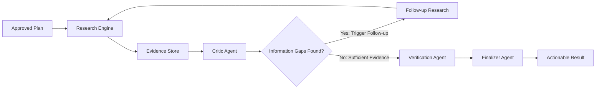

# AutoWork — Autonomous Goal-to-Action Agent

[](https://github.com/google/adk-python)
[](https://cloud.google.com/run)
[](https://cloud.google.com/pubsub)
[](https://cloud.google.com/firestore)
[](LICENSE)
[](https://python.org)
[]()
[-brightgreen.svg)]()

### *Give it a goal. Approve once. Let it work.*

AutoWork transforms high-level user goals into structured execution plans, waits for a **single human approval**, then autonomously executes the approved workflow in the background on **Google Cloud**.

It researches, analyzes evidence, **critiques its own work**, identifies information gaps, performs follow-up research, **verifies the result**, and produces actionable recommendations.

Built with **Gemini**, **Google Agent Development Kit (ADK 2.0)**, and **Google Cloud**.

---

## 🎬 4-Minute Video Demonstration

See [`DEMO.md`](DEMO.md) for the full demonstration script and video timeline.

---

## 🛑 Problem: The "Chatbot Orchestration Tax"

Modern AI assistants operate as synchronous prompt-and-answer engines:
```text
User asks  →  AI responds  →  User asks again  →  AI responds
```
For complex work, the user must manually:
- Break the problem into sub-tasks.
- Babysit blocking browser windows during multi-step reasoning.
- Search and cross-reference information.
- Identify missing information and write follow-up prompts.
- Verify evidence grounding manually.
- Synthesize conclusions and determine concrete next steps.

**AutoWork removes this orchestration burden.**

---

## 💡 Solution: Goal → Plan → Approve → Execute → Verify → Act

```text
User provides a high-level goal.
        ↓
AutoWork creates a structured Directed Acyclic Graph (DAG) plan.
        ↓
User reviews and approves ONCE.
        ↓
AutoWork executes independently in the background on Google Cloud.
        ↓
Specialist agents search, collect evidence, and analyze.
        ↓
Critic Agent audits evidence and identifies information gaps.
        ↓
Follow-up research dynamically fills missing data.
        ↓
Verification Agent checks grounding and scores confidence.
        ↓
Final actionable deliverable with traceable citations.
```

---

## 🌟 Key Differentiators

1. **Goal-Oriented**: Specifies desired outcomes rather than prompt-by-prompt instructions.
2. **One-Time Approval**: The human approves the roadmap once; no babysitting required.
3. **Autonomous Execution**: Runs multi-step workflows independently.
4. **Self-Refining Intelligence**: Critic Agent detects gaps and triggers automated follow-up research.
5. **Evidence-Based & Grounded**: Every claim is backed by authentic source citations.
6. **Factual Verification**: Verification Agent computes a confidence score (e.g. 92%).
7. **Cloud-Native Asynchronous Runtime**: Decouples user requests via Google Cloud Pub/Sub and Cloud Run Workers.
8. **Persistent State**: Firestore checkpointing ensures executions survive browser refreshes.

---

## 🏗️ Google Cloud System Architecture

```mermaid
flowchart TD
    subgraph Client["1. User Interface"]
        U["User"]
        UI["AutoWork Web Dashboard"]
    end

    subgraph API["2. Cloud Run API Service (autowork-api)"]
        GA["Goal Analyzer (LlmAgent)"]
        PG["Plan Generator (LlmAgent)"]
        APPR["Approval & Gatekeeper"]
    end

    subgraph Queue["3. Asynchronous Job Queue"]
        PS["Google Cloud Pub/Sub<br/>(Topic: autowork-executions)"]
        SUB["Push Subscription<br/>(autowork-worker-subscription)"]
    end

    subgraph State["4. Persistent State Store"]
        FS[("Google Cloud Firestore<br/>(Collections: plans, executions)")]
    end

    subgraph Worker["5. Cloud Run Worker Service (autowork-worker)"]
        LEASE["Idempotent Atomic Lease Claim"]
        RT["AutoWork Phase 3 ADK Runtime"]
        RE["Research Engine & Grounded Citations"]
        CR["Critic Agent & Refinement Loop"]
        VA["Verification Agent"]
        FA["Finalizer Agent"]
    end

    subgraph AI["6. Google AI Backbone"]
        GEM["Gemini (gemini-3.5-flash / Vertex AI)"]
    end

    U -->|Submit Goal & Approve Plan| UI
    UI -->|REST API| API
    API -->|1. Create Plan & Authorize| FS
    API -->|2. Publish execution_id (Non-blocking)| PS
    API -->|3. Return immediately (QUEUED)| UI

    PS -->|Push Message| SUB
    SUB -->|Invoke Worker Endpoint| LEASE
    LEASE -->|Claim Lock (QUEUED → RUNNING)| FS
    LEASE -->|Execute Plan| RT

    RT --> RE & CR & VA & FA
    RT <--> GEM
    RT -->|Stream Logs & Checkpoints| FS
    FA -->|Persist Actionable Result| FS

    UI -.->|Poll Live Progress & Results| FS
```

---

## 🔄 The Autonomous Intelligence Loop (Search → Critique → Refine → Verify)



---

## ☁️ Google Cloud Services Mapping

| Google Cloud Service | Role in AutoWork |
| :--- | :--- |
| **Google Cloud Run** | Hosts two decoupled container services: `autowork-api` (interactive REST API & Dashboard) and `autowork-worker` (serverless background execution). |
| **Google Cloud Pub/Sub** | Asynchronous job queue (`autowork-executions`) ensuring non-blocking request handling and guaranteed message delivery. |
| **Google Cloud Firestore** | Scalable NoSQL persistence storing plan DAGs, approval authorizations, operational logs, and final actionable deliverables. |
| **Google Vertex AI / Gemini** | High-throughput cognitive backbone powering goal understanding, critique gap analysis, and final synthesis. |
| **Google Cloud Build** | Automated CI/CD container build pipeline (`cloudbuild.yaml`) deploying to Artifact Registry and Cloud Run. |
| **Google Cloud Logging** | Structured operational telemetry and audit logging. |

---

## 🛠️ Technology Stack

- **AI Model**: Google Gemini (`gemini-3.5-flash`) via Google Cloud Vertex AI / Gemini API
- **Agent Framework**: Google Agent Development Kit (ADK 2.0)
- **Cloud Infrastructure**: Google Cloud Run, Cloud Pub/Sub, Cloud Firestore, Cloud Build
- **API & Worker Layer**: FastAPI, Uvicorn, Python 3.12
- **Data Validation**: Pydantic v2
- **Testing**: Pytest (55 automated tests passing with 100% pass rate)
- **Code Quality**: Ruff (0 lint errors)
- **Development Accelerator**: Antigravity IDE

---

## 🚀 Quickstart & Local Development

### 1. Install Dependencies
```bash
cd autowork
uv sync --dev
```

### 2. Configure Environment
```bash
cp .env.example .env
# Edit .env and insert your GEMINI_API_KEY or configure Vertex AI
```

### 3. Run Test Suite (55 Tests)
```bash
uv run pytest -v
```

### 4. Launch Local Web Dashboard
```bash
uv run uvicorn app.server:api_app --host 127.0.0.1 --port 8000 --reload
```
Open **[http://localhost:8000](http://localhost:8000)** in your browser.

---

## ☁️ Google Cloud Deployment (3 Steps)

```bash
chmod +x scripts/*.sh

# 1. Enable Cloud APIs, Firestore, Pub/Sub, and IAM Service Accounts
./scripts/setup_gcp.sh

# 2. Deploy API Service to Cloud Run
./scripts/deploy_api.sh

# 3. Deploy Background Worker Service to Cloud Run & wire Pub/Sub push
./scripts/deploy_worker.sh
```

---

## 🏆 Hackathon Track & Requirements Matrix

**Primary Track: Taskmaster (Autonomous Multi-Step Goal Execution)**

| Hackathon Requirement | AutoWork Implementation |
| :--- | :--- |
| **Gemini 3.5+ Model** | Google Gemini (`gemini-3.5-flash`) runtime |
| **Google Agent Framework** | Google Agent Development Kit (ADK 2.0) |
| **Google Cloud Infrastructure** | Google Cloud Run (API + Worker), Pub/Sub, Firestore |
| **Asynchronous Background Execution** | Decoupled Cloud Pub/Sub queue with atomic idempotency leases |
| **Complex Multi-Step Workflow** | Directed Acyclic Graph (DAG) task decomposition |
| **Autonomous Self-Correction** | Search → Critique → Gap Detection → Refinement → Verification |
| **Human-in-the-Loop Governance** | One-time human approval gate with explicit authorization tickets |
| **Safety & Consequential Gating** | External mutations safely isolated as proposed recommendations |
| **Grounded Citations** | Authentic source URLs, excerpts, and relevance confidence scoring |
| **Persistent State** | Cloud Firestore native schema tracking execution checkpoints |
| **Production Architecture** | Decoupled API and Worker microservices with health probes |
| **Reproducibility** | Complete README, automated setup scripts, and 55 passing tests |

---

## 🛡️ Safety & Control Principles

1. **No Automatic Execution**: Generated plans never execute without explicit human approval.
2. **Deterministic Governance**: Authorization logic is enforced in the application layer, not inferred by the LLM.
3. **Strict Resource Budgets**: Research is capped at 3 iterations, 15 search calls, and strict query timeouts to prevent runaway costs.
4. **External Mutation Gating**: Actions marked `EXTERNAL_ACTION` or `DESTRUCTIVE` are presented as recommendations for human implementation rather than blind automated execution.
5. **Persistent Audit Trail**: Full execution histories and critique logs are retained in Firestore.

---

## ⚠️ Limitations & Honest Engineering Disclosure

- **External Integrations**: Currently focused on analytical, strategic, and research workflows; write-back connectors (e.g. direct Jira ticket creation) require human manual confirmation.
- **Search Freshness**: Dependent on search indexing and API latency.
- **Authentication**: MVP uses bearer tokens and service accounts; production multi-tenant deployment would incorporate OAuth2/OIDC.

---

## ⚡ Development Note: Antigravity Accelerator

AutoWork was developed using **Antigravity** as a pair-programming development accelerator to meet the hackathon's accelerated development schedule. Antigravity is not part of the runtime architecture; the runtime is **Python 3.12 + Google ADK 2.0 + Gemini + Google Cloud**.

---

## 🔮 Future Roadmap

- [ ] Multi-party collaborative approval gates for enterprise teams.
- [ ] Direct bi-directional integrations with GitHub, Jira, and Slack.
- [ ] Mid-flight execution checkpoint branching and rollbacks.
- [ ] Multi-region active-active Cloud Run worker pools.
